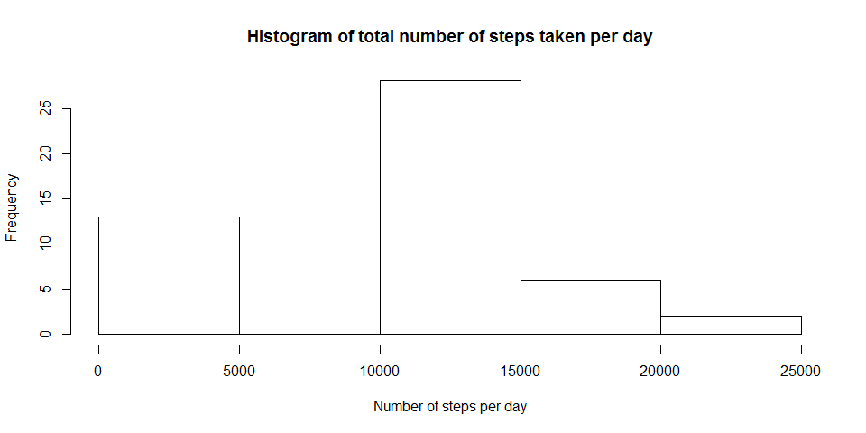
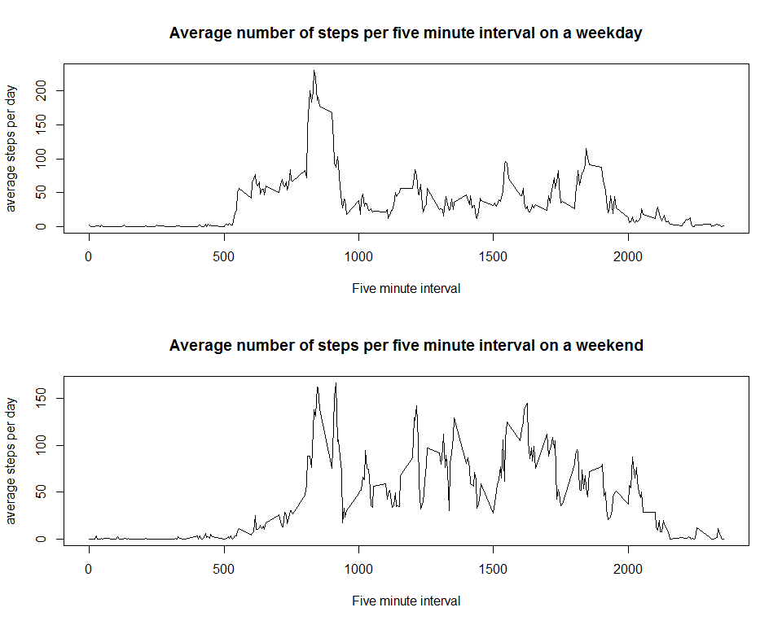

## Loading and preprocessing the data
The data is downloaded and read using the R code below:


```r
destfile = "./data/dataset.zip"
fileURL <- "https://d396qusza40orc.cloudfront.net/repdata%2Fdata%2Factivity.zip"
if (!file.exists(destfile)) {
  if(!file.exists(dirname(destfile))){dir.create(dirname(destfile))}
  download.file(fileURL,destfile=destfile)
  unzip(destfile,exdir = dirname(destfile))
}

if (!exists("act")) {
  act <- read.csv("./data/activity.csv")
}
```


## What is mean total number of steps taken per day?

To work this out, first, calculate the total number of steps per day, using the following code chunk.

```r
library(dplyr)
totsteps <- group_by(act,date) %>%
            summarise(steps = sum(steps, na.rm = TRUE))
```

Create a histogram of the data using the chunk below, and note the output.

```r
hist(totsteps$steps, main = "Histogram of total number of steps taken per day", xlab = "Number of steps per day")
```

<!-- -->

Find the mean and median values of the total steps per day.

```r
smean <- mean(totsteps$steps)
smedian <- median(totsteps$steps)
```

The mean number of steps taken per day is 9,354 and the median number is 10,395.


## What is the average daily activity pattern?

To work this, out, first find the daily average of each 5-minute period

```r
avestep <- group_by(act,interval) %>%
           summarise(steps = mean(steps, na.rm = TRUE))
```

Then plot the daily average, using the code below, and note the output.

```r
with(avestep,plot(interval,steps,type = "l",xlab = "Five minute interval",
                  ylab = "average steps per day",main="Average number of steps per five minute interval"))
```

<!-- -->

Identify the five minute interval with the most steps on average:

```r
mstep <- subset(avestep,avestep$steps==max(avestep$steps))[1,1]
```

The 5-minute interval with the most average steps per day is interval 835.


## Imputing missing values

Identify how many rows have missing values, using this code:


```r
nnas <- sum(is.na(act$steps))
```

The number of missing values in the dataset is 2,304.

Infill the missing values with the average value for the interval. Use this code:

```r
actinfill <- merge(act,avestep,by.x="interval",by.y="interval")
actinfill$steps.x[is.na(actinfill$steps.x)] <- actinfill$steps.y[is.na(actinfill$steps.x)]
actinfill <- select(actinfill,interval,steps=steps.x,date)
```

Create a histgram using the new infilled values:

```r
totsteps2 <- group_by(actinfill,date) %>%
             summarise(steps = sum(steps, na.rm = TRUE))
hist(totsteps2$steps, main = "Histogram of total number of steps taken per day (with missing data imputed)", 
     xlab = "Number of steps per day")
```

<!-- -->

Find the mean and median values of the total steps per day.

```r
s2mean <- mean(totsteps2$steps)
s2median <- median(totsteps2$steps)
```

With infilled data, the mean number of steps taken per day is 10,766 and the median number is 10,766. The equivalent values for the original data were 9,354 and 10,395 respectively. Therefore, imputing the missing data has increased both the mean value and the median value (curiously, the mean and median is identical).


## Are there differences in activity patterns between weekdays and weekends?

Create a new dataset, based on the imputed dataset, with a factor variable to identify weekends and weekdays:

```r
facdat <- mutate(actinfill,daytype = factor(weekdays(as.Date(date)) %in% c("Saturday","Sunday"),
                 labels = c("Weekday","Weekend")))
```

Calculate the average steps in each interval for weekends and weekdays

```r
avestep2 <- group_by(facdat,interval,daytype) %>%
            summarise(steps = mean(steps, na.rm = TRUE))
wdayave <- filter(avestep2,daytype=="Weekday")
wendave <- filter(avestep2,daytype=="Weekend")
```

Create a plot for weekend and weekday average steps per interval:

```r
par(mfrow=c(2,1))
with(wdayave,plot(interval,steps,type = "l",xlab = "Five minute interval",
                  ylab = "average steps per day",
                  main="Average number of steps per five minute interval on a weekday"))
with(wendave,plot(interval,steps,type = "l",xlab = "Five minute interval",
                  ylab = "average steps per day",
                  main="Average number of steps per five minute interval on a weekend"))
```

<!-- -->

The weekday plots show more activity around morning and evening rush hour. Weekend plots show activity is more even throughout the day.
